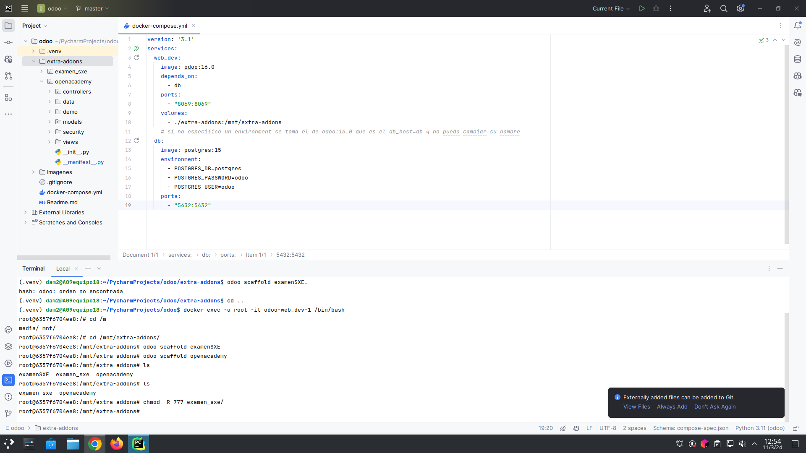
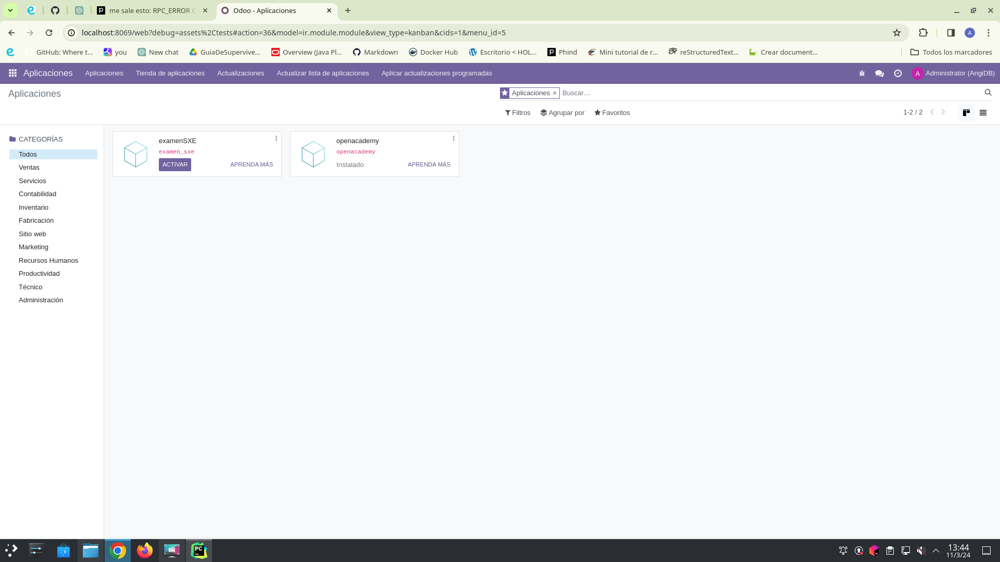

# Examen de Odoo
## 1. Crear un módulo en Odoo
Entramos en la terminal como root dentro del contenedor de Odoo, para poder crear en el directorio de addons el módulo que vamos a desarrollar.


Luego, creamos el archivo manifest.py con la información del módulo.
 [manifest.py](__manifest__.py)



## 2. Crear un modelo en Odoo
Creamos el archivo tabla.py con la clase que va a representar el modelo.
```
# -*- coding: utf-8 -*-

from odoo import fields, models

class TestModel(models.Model):
    _name = "test_modelo"
    _description = "test_modelo"

    id = fields.Integer(string="ID")
    producto = fields.Char(string="Producto")
    viabilidad = fields.Float(string="Viabilidad")
```
Y debemos importarlo en el archivo [init.py](__init__.py)

## 3. Crear Datos de la tabla
Creamos un directorio data y dentro el archivo [datos.xml](./data/datos.xml)
